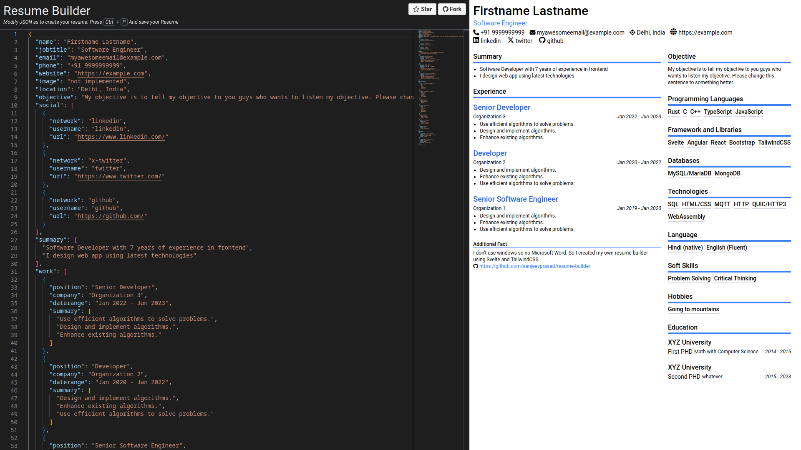

# Resume builder

I don't use windows so no Microsoft Word. All google docs and other resume templates are looks like garbage to me. So I created my own resume builder using Svelte and TailwindCSS.
just edit json to quickly create or update your resume. set showfact to false to hide Additional fact from your pdf.

You can download pdf by pressing `ctrl` + `p`. and remove margin from the print menu.

Live demo => https://sanjeevprasad.net/resume-builder/

Use your browser to create your resume quickly, by just editing JSON. No data is transferred or saved.
If you want to save a copy, it is recommended to save it manually in a json file on your own system.

# Build Step
```sh
#!/bin/sh
# clone and cd to repo
npm install
npm run dev
# now visit 127.0.0.1:4200/resume-builder/
```

# Preview


